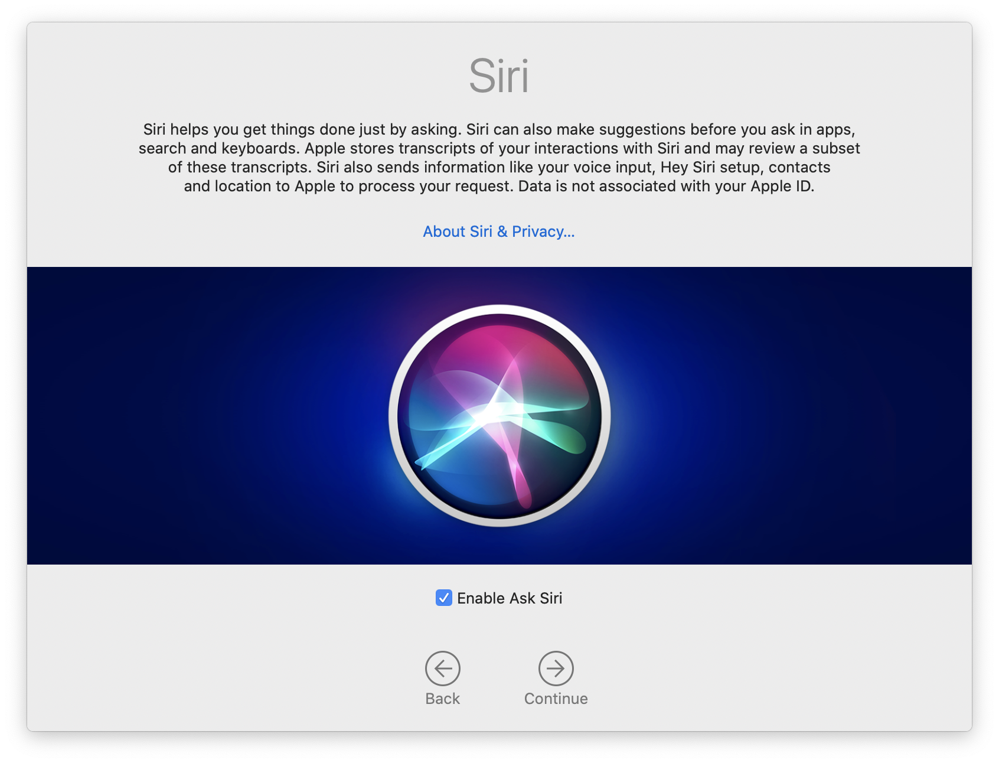
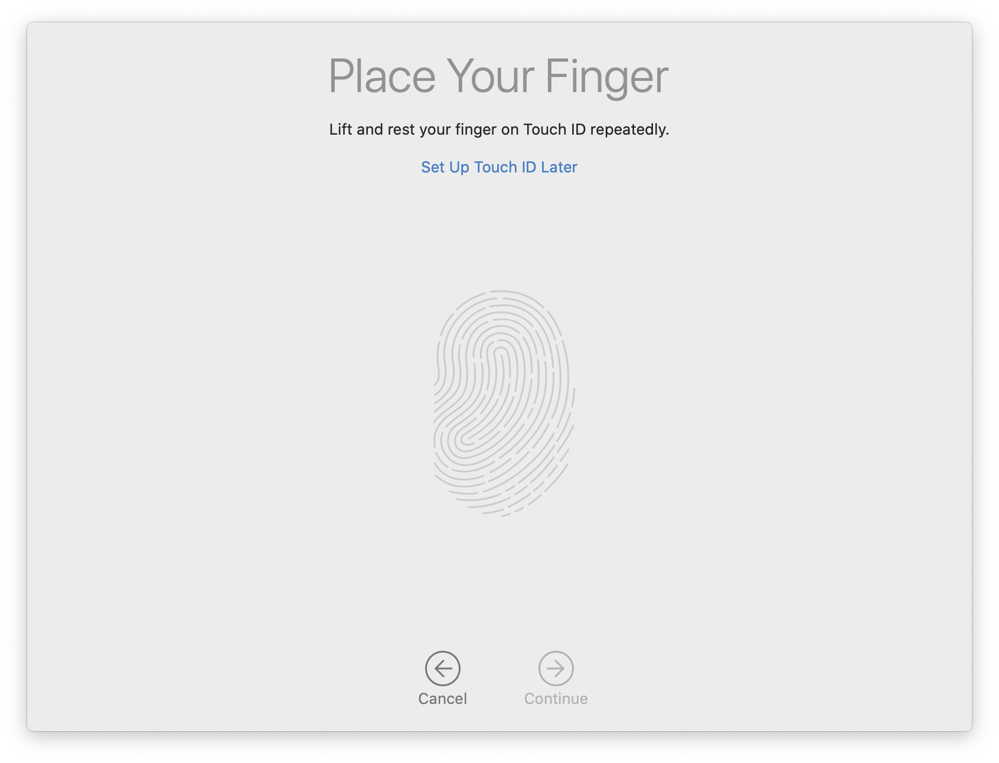
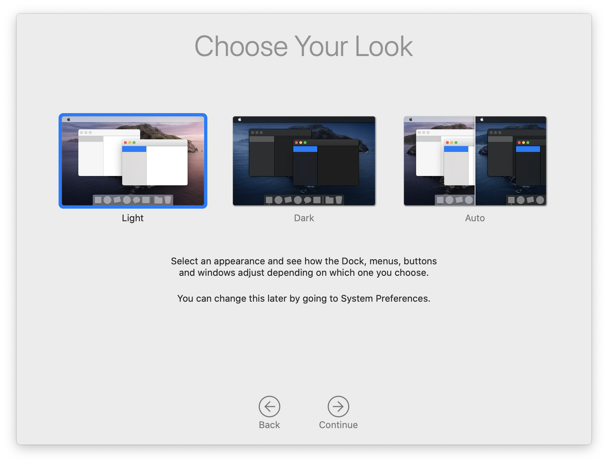
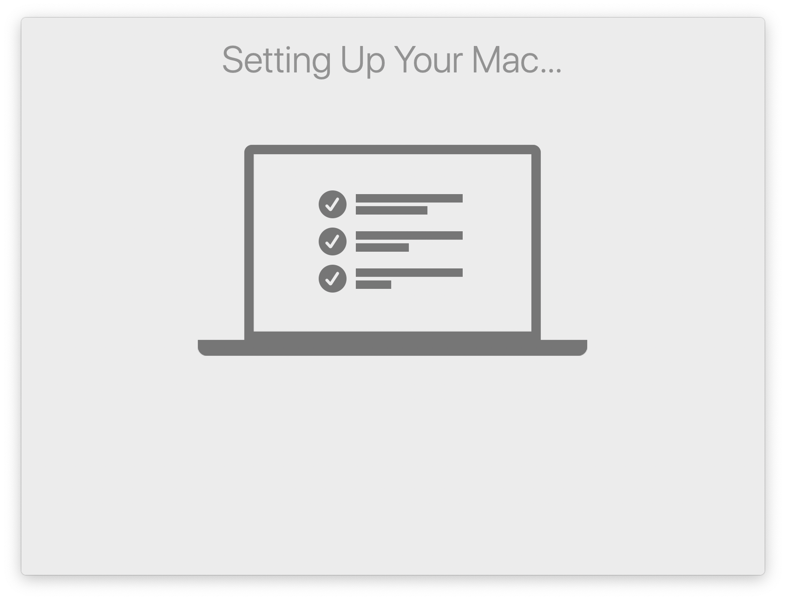

I came across an interesting phenomenon regarding Automated Device Enrollment (DEP) and macOS's Setup Assisant that I hadn't considered before, while investigating a problem on some managed Mac computers. I'm not sure if it's widely known or not, but since I didn't know it, perhaps others are also not aware.

I've been encountering problems since the release of macOS Catalina where a Mac gets stuck during Setup Assistant at the "Screen Time" pane, when the user presses "Set Up Later". The link greys out, but then Setup Assistant does not progress. In the past, pressing `Cmd-Q` would quit the Assistant and allow the Desktop to appear, but recently (I think since 10.15.4), this has stopped working, so the only option remaining is to force shutdown the computer, start up again, and login as the affected user.

This problem did not only occur when setting up a new computer, but also when upgrading to Catalina, updating to a new version of Catalina, or creating a new user.

I opened a ticket with Apple Enterprise Support, who could not reproduce the issue but asked if I was using MDM. We use [Jamf Pro] as our MDM.

I performed some tests, and found that a different Mac that was enrolled to the same Jamf server but using User-Initiated Enrollment rather than DEP did not have the same problem. I could create a new user and progress through the usual Setup Assistant Screens, and get to the desktop.

I then unenrolled one of the affected computers using the `sudo jamf removeFramework` command, and again, the problem went away. After the Screen Time Setup pane, the Siri Setup pane appeared, and then the "Setting Up Your Mac" pane and the desktop:

 
 

## Skipping PreStage Enrollment Settings

When enrolling with DEP, we tend to set up Jamf Pro's PreStage Enrollment options to skip most Setup Assistant panes to speed up enrollment. It never occurred to me that these settings would affect Setup Assistant beyond enrollment, e.g. during upgrade or when creating new users. But, on thinking about it, I was only seeing the Screen Time pane when creating a new user on the device that had been enrolled using DEP. I'd just never considered how that was being set.

I took a look at the settings in that particular PreStage Enrollment:

Screen Time was not skipped, because this PreStage Enrollment was created before Screen Time was an available option. All other options are skipped, except Location Services. The Location Services screen does not show up when setting up a new user, presumably because this is a system-wide rather than user-specific setting.

So, after re-enrolling the computer using the `sudo profiles renew -type enrollment` command, I set Screen Time to be skipped in the PreStage, and then created a new user on the computer. I still encountered the same problem with the Screen Time pane.

I once again unenrolled the computer, re-enrolled it, and created another new user. **Bingo**, straight to the "Setting Up Your Mac" pane, and then to the desktop.

That means that the settings only apply at enrollment, but persist for all future runs of Setup Assistant.

## Is there a bug, then?

There's clearly a bug where skipping some panes results in Setup Assistant failing to complete. I haven't gone through all of the possible iterations of skipping different panes, but suffice to say that if you skip everything except Screen Time, you may encounter this problem.

I have updated my case with Apple Enterprise Support with this information, and will open a ticket with Jamf Support in case this is Jamf-specific.

# Conclusion

I personally had not previously made the connection that the settings in a PreStage Enrollment for skipping Setup Assistant panes persist for all future Setup Assistant runs, including after upgrades and when creating new users.

This is potentially problematic, because new Setup Assistant panes are being introduced with each new version of macOS, such as Privacy Settings, "Choose Your Look", Screen Time etc. You cannot change these settings in a configuration profile, you can only change them in the DEP settings, which are only applied at enrollment. The only way to change the settings is to re-enroll the device.

This is not really anything more than a minor inconvenience, but due to a bug - most likely in Apple's Setup Assistant, but perhaps just with Jamf Pro - if you skip all screens other than Screen Time, and your user presses "Set Up Later" after installing a macOS update, they will get locked out of their device and have to force restart to continue.

Again, that's not the end of the world, but hopefully Apple will fix the problem to reduce support tickets. And, who knows if it will also happen with whatever new Setup Assistant panes we get with macOS 10.16?

Let me know in the comments or in Slack (and let Apple and your MDM provider know) if you have encountered this issue with other MDM providers.


